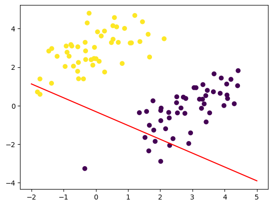

# 感知机

感知机（perceptron）是二分类的线性判别模型，其旨在求出将训练数据所处的特征空间进行线性划分的分离超平面。感知机学习算法简单，易于实现，具有原始形式与对偶形式，是神经网络与支持向量机的基础

## 分类
- 监督学习方法
- 非概率模型
- 参数化模型
- 线性模型
- 判别学习方法

## 感知机模型

设训练数据集为

$$
T=\{(x_1,y_1),(x_2,y_2),···,(x_N,y_N)\},\quad x\in \mathcal{X},y\in \mathcal{Y}
$$

其中输入空间 $\mathcal{X}\subseteq R^n$ 为 $n$ 维空间向量的集合，输出空间为类标记集合 $\mathcal{Y}=\{+1,-1\}$

由输入空间到输出空间的如下函数称为感知机：

$$
f(x)=sgn(w \cdot x +b)
$$

其中感知机参数 $w\in R^n$ 称为权值/权重， $b\in R$ 称作偏置

## 数据集的线性可分性

如果对于一个数据集 $T=\{(x_1,y_1),(x_2,y_2),···,(x_N,y_N)\}$，如果存在某个超平面 $S:w \cdot x +b=0$ ,使得所有 $y_i=+1$ 的实例 $i$ ，有 $w\cdot x_i +b > 0$ （反之亦然），则称该数据集为线性可分的

## 感知机学习策略

假设训练数据集是线性可分的，感知机学习的目标即是求得一个能够将训练集正负实例点完全正确分开的分离超平面，即感知机参数 $w,b$

为此需要定义（经验）损失函数并将损失函数极小化

损失函数的一个直观选择即是误分类点的总数，但这样的损失函数不是参数 $w,b$ 的连续可导函数，不易优化，因此我们选择误分类点到超平面 $S$ 的总距离

对于任一误分类点 $x_0$ 到超平面的距离：

$$
\frac{1}{\Vert w\Vert _2}\vert w \cdot x_0 + b\vert
$$

对于误分类点 $(x_i,y_i)$ ,有

$$
-y_i(w \cdot x_i +b) > 0
$$

故所有误分类点到超平面 $S$ 的总距离为：

$$
-\frac{1}{\Vert w\Vert}\sum_{x_i \in M}y_i(w \cdot x_i +b)
$$

于是我们将感知机学习的损失函数定义为：

$$
L(w,b) = - \sum_{x_i \in M}y_i(w \cdot x_i +b)
$$

其中 $M$ 为误分类点的集合，$y_i(w \cdot x_i +b)$ 称为样本点的函数间隔

可以看出，损失函数 $L(w,b)$ 是非负的，对于一个特定的样本点，在误分类时是参数 $w,b$ 的线性函数，在正确分类时是0。因此，$L(w,b)$ 是 $w,b$ 的连续可导函数

## 感知机学习算法

感知机的学习算法采用随机梯度下降（SGD）实现：

首先随机初始化感知机参数 $w_0,b_0$ ，然后用梯度下降法不断极小化目标函数

$$
L(w,b)=-\sum_{x_i \in M}y_i(w \cdot x_i +b)
$$

在极小化过程中，不是一次使 $M$ 的所有误分类点的梯度下降，而是一次随机选取一个误分类点使其梯度下降，其中 $L(w,b)$ 的梯度为

$$
\begin{aligned}
\nabla_{w}L(w,b)&=-\sum_{x_i \in M}y_ix_i \\
\nabla_{b}L(w,b)&=-\sum_{x_i \in M}y_i
\end{aligned}
$$

随机选取一个误分类点 $(x_i,y_i)$ ，对参数进行更新

$$
\begin{aligned}
w &\gets w + \eta y_ix_i \\
b &\gets b + \eta y_i
\end{aligned}
$$

其中 $\eta$ 称为学习率（learning rate）

### 感知机学习算法（原始形式）

输入：

- 训练数据集

    $T=\{(x_1,y_1),(x_2,y_2),···,(x_N,y_N)\}$

- 学习率 $\eta$

输出：感知机模型 $f(x)=sgn(w \cdot x +b)$ ；感知机参数 $w, b$

1. 选取初值 $w_0,b_0$ ;
2. 在训练集中选取数据 $(x_i,y_i)$ ;
3. 如果 $y_i(w \cdot x_i +b) \leq 0$ :

    $$
    \begin{aligned}
    w &\gets w + \eta y_ix_i \\
    b &\gets b + \eta y_i
    \end{aligned}
    $$

4. 转至 2 ，直至训练集中没有误分类点

在实际学习中感知机学习算法由于采取不同的初值或选取不同的误分类点，最后得到的模型，即参数 $w,b$ 可能不同

## 算法收敛性（Novikoff定理）

由Novikoff定理可知，对于线性可分数据集，感知机学习算法收敛，即经过有限次迭代可以得到一个将其完全正确划分的感知机模型

定理表明，感知机学习算法在线性可分数据集上学习时，误分类的次数 $k$ 是有上界的，经过有限次搜索可以找到将训练数据完全正确分开的分离超平面

当训练集线性不可分时，感知机学习算法不收敛，迭代结果会发生震荡

## 感知机学习算法的对偶形式

对偶形式的基本想法在于，将 $w$ 和 $b$ 表示为实例 $x_i$ 和 标记 $y_i$ 的线性组合形式，通过求解其系数从而求得 $w$ 和 $b$ ：

设初始值 $w_0, b_0$ 均为0，经过随机梯度下降后，迭代过的参数可表示为

$$
\begin{aligned}
w &=\sum_{i=1}^{N}\alpha_i y_i x_i\\
b &=\sum_{i=1}^{N}\alpha_i y_i
\end{aligned}
$$

其中，$\alpha_i=n_i\eta \geq 0, i=1,2,···,N$，其中 $n_i$ 表示第 $i$ 个实例点由于误分而进行更新的次数。实例点更新次数越多，意味着它距离分离超平面越近，也就越难正确分类，这样的实例对学习结果影响最大

### 感知机学习算法（对偶形式）

输入：

- 训练数据集

    $T=\{(x_1,y_1),(x_2,y_2),···,(x_N,y_N)\}$

- 学习率 $\eta$

输出：感知机模型 $f(x)=sgn\left(\sum_{j=1}^{N}\alpha_j y_j x_j \cdot x +b\right)$；感知机参数 $\alpha, b$ ；$\alpha = (\alpha_1, \alpha_2,···,\alpha_N)^T$

1. $\alpha \gets 0, b \gets 0$ ；
2. 在训练集中选取数据 $(x_i, y_i)$ ；
3. 如果 $\left(\sum_{j=1}^{N}\alpha_j y_j x_j \cdot x +b\right)\leq 0$ ：

    $$
    \begin{aligned}
    \alpha_i &\gets \alpha_i + \eta\\
    b &\gets b + \eta y_i
    \end{aligned}
    $$

4. 转至 2 直到没有误分类数据

在对偶形式中训练实例仅以内积的形式出现，为了方便我们可以提前计算出样本实例间的内积并以矩阵的形式存储，即为 Gram 矩阵（Gram matrix）

$$
G=[x_i \cdot x_j]_{N \times N}
$$

## 代码实现

引入基本库

```python
import numpy as np
import matplotlib.pyplot as plt
```

数据准备

```python
negative_samples = np.random.multivariate_normal( 
 mean=[3, 0], 
 cov=[[1, 0.65],[0.65, 1]], 
 size=50) 
positive_samples = np.random.multivariate_normal( 
 mean=[0, 3], 
 cov=[[1, 0.65],[0.65, 1]], 
 size=50)

x =  np.vstack((negative_samples, positive_samples)).astype('float32')
l = np.vstack((np.full((50, 1), -1), np.ones((50, 1)))).astype('float32')
```

### 原始形式

初始化参数

```python
w = np.random.randn(2,1).astype('float32')
b = np.random.randn(1,).astype('float32')
```

展示

```python
figurex = np.linspace(-2, 5, 100) 
figurey = - w[0] / w[1] * figurex - b / w[1]
plt.plot(figurex, figurey, "-r")
plt.scatter(x[:,0], x[:, 1], c=l[:,0])
plt.show()
```



训练

```python
index = 0
lr=1e-2
while(index < 100):
    if(l[index,0] * (np.matmul(x[index], w) + b) <= 0):
        w += (lr * l[index,0] * x[index]).reshape(2,1)
        b += lr * l[index,0]
        index = 0
    else:
        index += 1
```

展示

```python
figurex = np.linspace(-2, 5, 100) 
figurey = - w[0] / w[1] * figurex - b / w[1]
plt.plot(figurex, figurey, "-r")
plt.scatter(x[:,0], x[:, 1], c=l[:,0])
plt.show()
```


### 对偶形式

初始化参数

```python
gram = np.matmul(x,x.T)
alpha = np.random.randn(100,).astype('float32')
b = np.random.randn(1,).astype('float32')

def sig_al(arr):
    return np.array([a * b for a, b in zip(alpha,l.squeeze())])
```

展示

```python
figurex = np.linspace(-2, 5, 100) 
figurey = - np.matmul(sig_al(alpha),x[:,0].reshape(-1,1)) / np.matmul(sig_al(alpha),x[:,1].reshape(-1,1)) * figurex - b / np.matmul(sig_al(alpha),x[:,1].reshape(-1,1))
plt.plot(figurex, figurey, "-r")
plt.scatter(x[:,0], x[:, 1], c=l[:,0])
plt.show()
```

训练

```python
index = 0
lr=1e-2
while(index < 100):
    if(l[index,0] * (np.matmul(sig_al(alpha), gram[:,index].reshape(-1,1)) + b) <= 0):
        alpha[index] += lr
        b += lr * l[index,0]
        index = 0
    else:
        index += 1
```

展示

```python
figurex = np.linspace(-2, 5, 100) 
figurey = - np.matmul(sig_al(alpha),x[:,0].reshape(-1,1)) / np.matmul(sig_al(alpha),x[:,1].reshape(-1,1)) * figurex - b / np.matmul(sig_al(alpha),x[:,1].reshape(-1,1))
plt.plot(figurex, figurey, "-r")
plt.scatter(x[:,0], x[:, 1], c=l[:,0])
plt.show()
```

### 核方法 | 非线性二分类

数据准备

```python
negative_samples1 = np.random.multivariate_normal( 
 mean=[3, -4], 
 cov=[[0.8, 0],
      [0, 0.8]], 
 size=25) 

negative_samples2 = np.random.multivariate_normal( 
 mean=[3, 6], 
 cov=[[0.8, 0],
      [0, 0.8]], 
 size=25) 

positive_samples = np.random.multivariate_normal( 
 mean=[1, 0], 
 cov=[[0.8, 0],
      [0, 0.8]], 
 size=50)

x =  np.vstack((negative_samples1, negative_samples2, positive_samples)).astype('float32')
l = np.vstack((np.full((50, 1), -1), np.ones((50, 1)))).astype('float32')
```

初始化参数

```python
gram = np.matmul(x,x.T)
poly_kernel_gram = np.ones((100,100)).astype('float32')
for i in range(100):
    for j in range(100):
        poly_kernel_gram[i,j] = (1+gram[i,j]) ** 2

alpha = np.random.randn(100,).astype('float32')
b = np.random.randn(1,).astype('float32')


def sig_al(arr):
    return np.array([a * b for a, b in zip(alpha,l.squeeze())])
```

展示

```python
plt.scatter(x[:,0], x[:, 1], c=l[:,0])
plt.show()

pre = np.array([1 if (np.matmul(sig_al(alpha), poly_kernel_gram[:,index].reshape(-1,1)) + b) >= 0 else -1 for index in range(100)]).squeeze()

plt.scatter(x[:,0], x[:, 1], c=pre)
plt.show()
```

训练

```python
index = 0
lr=1e-2
while(index < 100):
    if(l[index,0] * (np.matmul(sig_al(alpha), poly_kernel_gram[:,index].reshape(-1,1)) + b) <= 0):
        alpha[index] += lr
        b += lr * l[index,0]
        index = 0
    else:
        index += 1
```

展示

```python
plt.scatter(x[:,0], x[:, 1], c=l[:,0])
plt.show()

pre = np.array([1 if (np.matmul(sig_al(alpha), poly_kernel_gram[:,index].reshape(-1,1)) + b) >= 0 else -1 for index in range(100)]).squeeze()

plt.scatter(x[:,0], x[:, 1], c=pre)
plt.show()
```


## 参考资料

-   《统计学习方法（第二版）》李航
