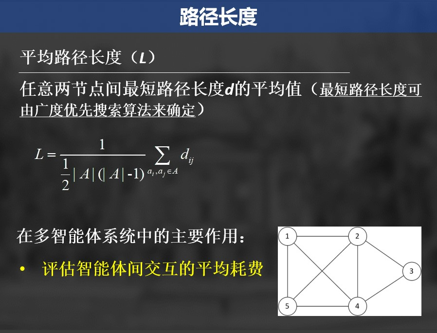
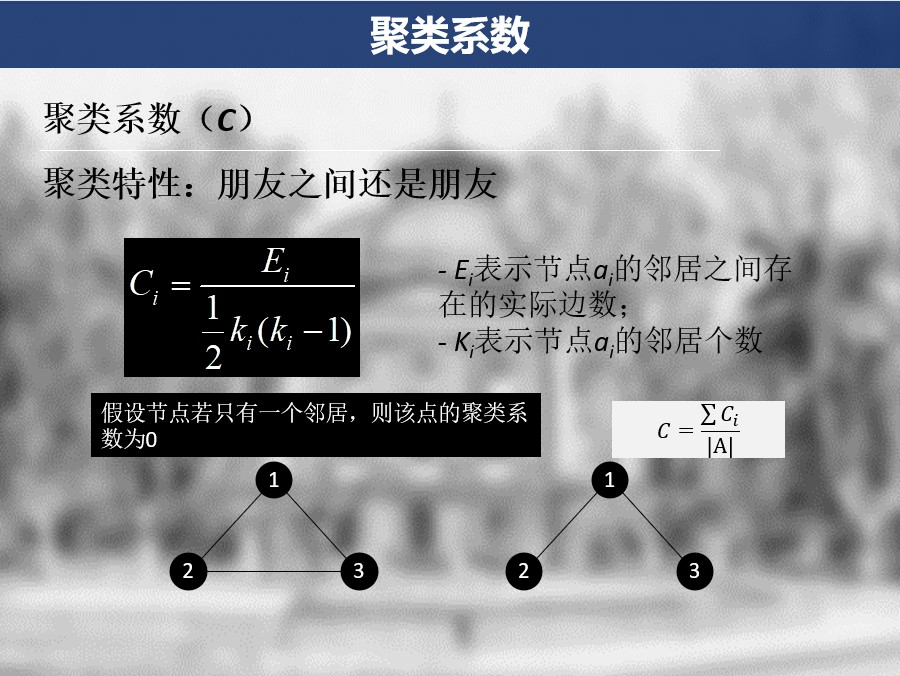

# Gradio & Hugging Face 实现网络结构可视化及部署

基于Hugging Face平台的可视化工具，不仅能将交互界面当做Web应用快速部署，甚至在Hugging Face上托管的程序提供了更加快捷的嵌入接口，这样我便能将可视化代码嵌入式的展示在个人静态博客中，效果也相当好

## 展示内容

为一些基本网络结构的可视化：

- 全局耦合网络（Globally Coupled Network）
- 最近邻耦合网络（Nearest-neighbor Coupled Network）
- NW小世界模型 （Newman&Watts World）

以及相关的性质计算：

- 平均路径长度（ASL）
- 平均聚类系数（ACC）

## 代码实现

### 网络结构

采取邻接矩阵的方式表示与存储，因为设定为无向图，因此矩阵为对称的方阵

### 平均路径长度（ASL）



利用 Floyd 算法计算每个节点的最短路径长度，最后取平均值

```python
def ASL(adj_matrix):
    num_nodes = adj_matrix.shape[0]    
    dist = np.copy(adj_matrix)         
    for i in range(num_nodes):
        for j in range(num_nodes):
            if dist[i][j] == 0 and i != j:
                dist[i][j] = float('inf')

    # Floyd
    for k in range(num_nodes):
        for i in range(num_nodes):
            for j in range(num_nodes):
                if dist[i][k] + dist[k][j] < dist[i][j]:
                    dist[i][j] = dist[i][k] + dist[k][j]

    total_shortest_path = 0                               
    for i in range(num_nodes):
        for j in range(num_nodes):
            if dist[i][j] != 0:
                total_shortest_path += dist[i][j]          
    avg_shortest_path = total_shortest_path / (num_nodes * (num_nodes - 1)) 
    return avg_shortest_path
```

### 平均聚类系数（ACC）



便历直接计数得出

```python
def ACC(input_matrix):
    size = input_matrix.shape[0]
    c = np.zeros(size)
    for i in range(size):
        node_neigh = np.where(input_matrix[i] == 1)[0]
        n_links = len(node_neigh)
        if n_links >= 2:
            k = 0
            for j in range(n_links-1):
                for l in range(j+1, n_links):
                    if input_matrix[node_neigh[j]][node_neigh[l]] == 1:
                        k += 1
            c[i] = 2.0 * k / (n_links * (n_links - 1))
        else:
            c[i] = 0
    return np.mean(c)
```

### Gradio 部署体验

最后可视化采用Gradio & Matplotlib实现，分别在个人站点（Nginx部署）与本文下方（Hugging Face部署嵌入）实现展示

由于个人站点暂无域名，安全考虑只提供本文下方的可视化体验

<gradio-app src="https://alexair-multi-agent-network-visualization.hf.space"></gradio-app>