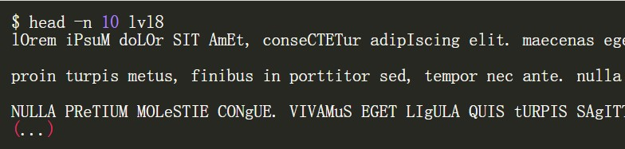
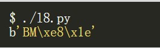
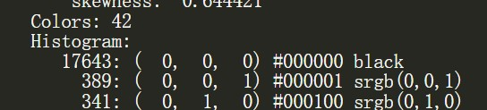
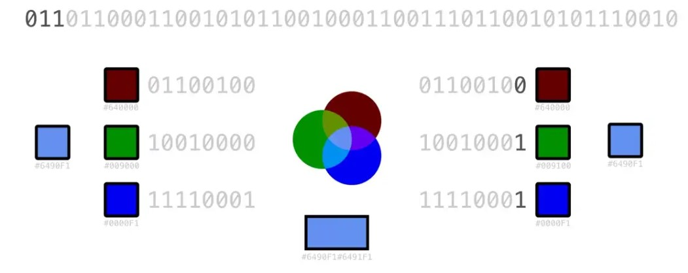
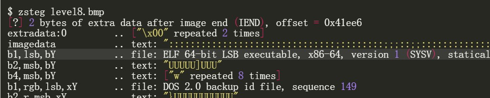
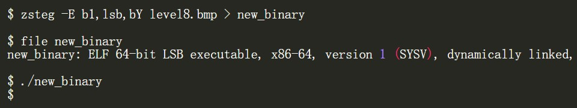

# 乱数假文&LSB隐写

### 乱数假文（Lorem ipsum）

对 lvl8 文件进行file分析，发现是一个文本内容文件：

发现形式上很像乱数假文

> ​	Lorem ipsum，中文又称“乱数假文”， 是指一篇常用于排版设计领域的拉丁文文章。目的是让阅读者不要被文章内容所影响，而只专注于观察字型或版型，并借此填满空间。

但是明显不符合正常的大小写命名

我们合理猜测应该是将目标内容加密在了文本当中

我们假设二进制文件是使用字符大小写编码的，为此我们忽略所有其他字符，如标点符号、空格、换行符等，将大写字母转换为1，小写字母转换为0

在编写python脚本进行转换后，我们发现文件开头ASCII码为：

它虽然不是ELF执行文件，但是我们也能得知这是一张位图开头标识符，我们将其以图形式打开

### 位图文件

转换后，我们得到该图：

在多方面尝试后（例如图片宽高、文件格式、内容编码等），仍没有明显可疑地方后，我们尝试利用较为全面的图片分析工具ImageMagick进行检测：

利用`identify -verbose level8.bmp`命令我们发现一个可疑的地方

表示颜色种类数多达42种，但从图中很明显并没有这么多，通过调节对比度与亮度后

可以看到图片下方采取了疑似LSB隐写的技术

### 隐写术

在图像文件中隐藏数据的一种常见而简单的隐写技术

通过稍微修改图像像素的RGB值，我们可以嵌入要隐藏的数据：将想要隐藏的数据位覆盖红色、绿色和蓝色通道的最低有效位，称为LSB隐写

例如在该图中我们仅改变了G通道上的LSB，对颜色的改变也仅仅由 #6490F1 变为了 #6491F1，从肉眼上是难以区分的，但理论上一张 W$\times$H 的位图能提供最大 W$\times$H$\times$3\8 字节的隐写空间

利用常见的LSB隐写工具，我们可以检测bmp是否经过常见的LSB加密，这里我们使用zsteg：

可以看到在b1位上经过LSB解密检测到ELF的文件标识符，说明这极有可能是被加密隐藏的文件

我们利用zsteg进行提取：

通过file工具可以确认这是需要得到的隐写ELF文件