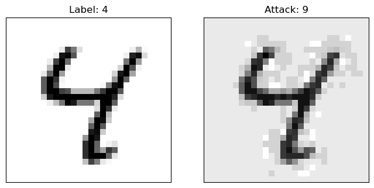

# FGSM攻击

记录一次图对抗攻击，尝试快速梯度符号攻击（FGSM）迷惑MNIST分类器

## 对抗性攻击（Adversarial Attack）

由于机器学习算法的输入形式是一种数值型向量（numeric vectors），所以便能设计一种有针对性的数值型向量让机器学习模型做出误判，这便被称为对抗性攻击

从样本的角度看，被修改过后的具有针对性的数值型向量便是对抗样本

基于攻击者先验知识与攻击目标，可以将对抗性攻击分为不同类型：

- 黑盒攻击（black-box）：攻击者只能访问模型的输入和输出，并且对底层架构或权重一无所知
- 白盒攻击（white-box）：攻击者具有对模型的完整知识和访问权限，包括体系结构、输入、输出和权重
- 错误分类（misclassification）：只希望输出分类错误，而不在乎新的分类是什么
- 源/目标错误分类（source/target misclassification）：希望更改最初属于特定源类别的图像，从而将其分类为特定目标类别

基于对抗攻击领域，个人认为也能分成多类，较为普遍的是**图对抗攻击**

## FGSM（Fast Gradient Sign Attack）

快速梯度符号攻击（Fast Gradient Sign Attack）[^1] 是最早且最流行的对抗攻击方式之一

[^1]: Goodfellow I J, Shlens J, Szegedy C. Explaining and harnessing adversarial examples[J]. arXiv preprint arXiv:1412.6572, 2014

FGSM的思想十分直观且有效：利用神经网络的学习方式，即梯度来进行攻击，利用模型的反向传播梯度，调整样本数据以最大化损失


从图中可以看出，$x$是被正确分类为“panda”的原始输入图像，$y$是$x$的真实标签，$\mathbf θ$代表模型参数，$J（\mathbfθ ，x，y）$是用于训练网络的损失。攻击将梯度反投影到输入数据，以计算$\nabla_{x}J（\mathbf θ，x，y）$。然后，它在方向（即$\nabla_{x}J（\mathbf θ，x ，y）$符号）上调整输入数据$x$一定步幅（ε或图中的0.007）。结果得到的扰动图像$x^{\prime}$然后被目标网络误分类为“gibbon”

## Pytorch & Keras 代码实现

### 数据集

均采用框架内置提供的 MNIST 手写数字数据集

### 模型

Torch 导入修改后的预训练 LeNet 模型；TensorFlow 直接训练得到 LeNet 模型

### 实现

=== "Torch"

```python
import torch
import torch.nn as nn
import torch.nn.functional as F
import torch.optim as optim
from torchvision import datasets, transforms
import numpy as np
import matplotlib.pyplot as plt

# configuration
epsilons = [0, .05, .1, .15, .2, .25, .3]
pretrained_model = "./lenet_mnist_model.pth.pt"
use_cuda= False
device = torch.device("cuda" if use_cuda and torch.cuda.is_available() else "cpu")

# Model under Attack
class Net(nn.Module):
    def __init__(self):
        super(Net, self).__init__()
        self.conv1 = nn.Conv2d(1, 32, 3, 1)
        self.conv2 = nn.Conv2d(32, 64, 3, 1)
        self.dropout1 = nn.Dropout(0.25)
        self.dropout2 = nn.Dropout(0.5)
        self.fc1 = nn.Linear(9216, 128)
        self.fc2 = nn.Linear(128, 10)

    def forward(self, x):
        x = self.conv1(x)
        x = F.relu(x)
        x = self.conv2(x)
        x = F.relu(x)
        x = F.max_pool2d(x, 2)
        x = self.dropout1(x)
        x = torch.flatten(x, 1)
        x = self.fc1(x)
        x = F.relu(x)
        x = self.dropout2(x)
        x = self.fc2(x)
        output = F.log_softmax(x, dim=1)
        return output

# Sample Datas for FGSM
MNIST_datasets = datasets.MNIST('./data',
                                train=False,
                                transform=transforms.Compose([transforms.ToTensor()]))

MNIST_loader = torch.utils.data.DataLoader(MNIST_datasets, batch_size=256, shuffle=True)

for item in MNIST_loader:
    datas = item[0]
    targets = item[1]
    break

# FGSM Attack
datas.requires_grad = True

model = Net().to(device)
model.load_state_dict(torch.load('./lenet_mnist_model.pth.pt', map_location=device))
model.eval()

outs = model(datas.to(device))
loss = F.nll_loss(outs, targets)

datas_grad = datas_grad[0]

perturbed_datas = datas + epsilons[1] * datas_grad.sign()

## Test after Drawing One Epsilon
model(datas).argmax(axis=1) == model(perturbed_datas).argmax(axis=1)

ex = datas[17].squeeze().detach().numpy()
target = targets[17].numpy()
adv = perturbed_datas[17].squeeze().detach().numpy()
adv_target = model(perturbed_datas).argmax(axis=1)[17].numpy()

plt.figure(figsize=(8,10))

plt.subplot(1,2,1)
plt.title(f'Label: {target}')
plt.xticks([],[])
plt.yticks([],[])
plt.imshow(ex, cmap='gray')

plt.subplot(1,2,2)
plt.title(f'Attack: {adv_target}')
plt.xticks([],[])
plt.yticks([],[])
plt.imshow(adv, cmap='gray')

# plt.tight_layout()
```

=== "TensorFlow"

```python
import tensorflow as tf
from tensorflow import keras
import numpy as np
from keras import layers
import matplotlib.pyplot as plt

# Mix-Precision Boost
tf.config.list_physical_devices('GPU')

tf.keras.mixed_precision.set_global_policy("mixed_float16")

# Configuration
epsilon = [0, .1, .15, .2, .25, .30, .35]

(train_images, train_labels), (test_images, test_labels) = keras.datasets.mnist.load_data()

train_images = train_images.astype("float32") / 255
test_images = test_images.astype("float32") / 255
train_images = train_images.reshape((*train_images.shape, 1))
test_images = test_images.reshape((*test_images.shape, 1))

# Model under Attack
input = keras.Input((28,28,1))
x = layers.Conv2D(32, 3, strides=1, activation='relu')(input)
x = layers.Conv2D(64, 3, strides=1, activation='relu')(x)
x = layers.MaxPooling2D(2)(x)
x = layers.Dropout(0.25)(x)
x = layers.Flatten()(x)
x = layers.Dense(128, activation='relu')(x)
x = layers.Dropout(0.5)(x)
output = layers.Dense(10, activation='softmax')(x)

model = keras.Model(inputs=input, outputs=output)

# Here We Have No Pre-trained Models So Train One
model.compile(optimizer="rmsprop",
              loss="sparse_categorical_crossentropy",
              metrics=["accuracy"])

model.fit(train_images, train_labels, epochs=20, batch_size=128, validation_split=0.2)

# Sample Datas for FGSM
datas = tf.constant(test_images[:256])
targets = tf.constant(test_labels[:256].astype('float16'))

# FGSM Attack
with tf.GradientTape() as tape:
    tape.watch(datas)
    tape.watch(targets)
    outs = model(datas)
    sparse_crossentropy_loss = tf.losses.SparseCategoricalCrossentropy()
    loss = sparse_crossentropy_loss(targets, outs)

datas_grad = tape.gradient(loss, datas)

perturbed_datas = datas + epsilon[1] * tf.sign(datas_grad)

# Test after Drawing One Epsilon
model(perturbed_datas).numpy().argmax(axis=1) == model(datas).numpy().argmax(axis=1)

ex = tf.squeeze(datas[6]).numpy()
target = targets[6].numpy().astype('int')

adv = tf.squeeze(perturbed_datas[6]).numpy()
adv_target = model(perturbed_datas).numpy().argmax(axis=1)[6]

plt.figure(figsize=(8,10))

plt.subplot(1,2,1)
plt.title(f'Label: {target}')
plt.xticks([],[])
plt.yticks([],[])
plt.imshow(ex, cmap='binary')

plt.subplot(1,2,2)
plt.title(f'Attack: {adv_target}')
plt.xticks([],[])
plt.yticks([],[])
plt.imshow(adv, cmap='binary')
```

### 攻击展示（TensorFlow）

