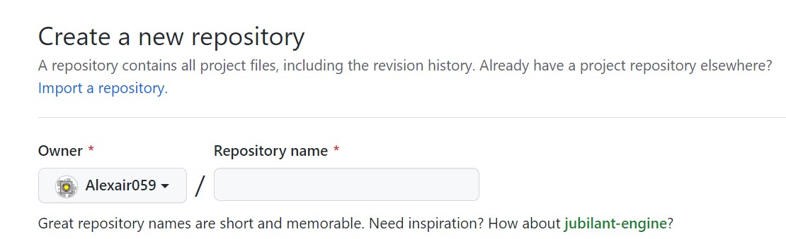

# 基于 mkdocs-material 的 Blog 工作流

晚上跟建筑系大神聊天，谈到如何搭建这个Blog的，于是记录一下自己摸索的过程，如果读者感兴趣也可以自己试试

## 初衷

跟大神聊天的时间，是愉快与轻松的，但也意识到不是所有人都对创建一个托管在Gitub Pages上的静态页面感兴趣。这既不是简历的加分项，也不是SRTP的创新点，更不是保研的绩点，甚至对于非计算机类的学生（例如建筑），大神说他们更倾向于去专门的网站与公众号获取业界相关的资讯

于是最后一个立意——用于向他人展示，多多少少也被否决

但我很喜欢，因为我写字很慢，打字尚可。配合 latex 与 markdown ，我能一点点把自己在现实与网络的收获记录下来，这样在很久很久之后，我想拿点东西证明自己做了点什么的时候，好歹还有个这个

其实某种程度上，也算聊以自慰的手段，也正因为如此，我私心希望更多的人能看到这个博客，看到对世界无止无息的探索愿望

## 前置知识
- 基本的命令行操作
- Git使用
- 任意代码编辑器的使用
- Github基本使用

## mkdocs-material 安装

具体参考官网Installation介绍

> https://squidfunk.github.io/mkdocs-material/getting-started/

## 创建仓库

在GitHub上创建一个repository



在Repository name一栏写上 `<你的用户名>.github.io` ，此时它应该会提醒你自动启动了github-pages服务

## Git同步仓库并创建mkdocs项目

在本地进行git clone，并初始化项目，具体参考Creating your site介绍

> https://squidfunk.github.io/mkdocs-material/creating-your-site/

## 配置文件的设置

除开官网参考的设置

```yaml
theme:
  name: material
```

有相当多的设置可以自行调节，下为个人习惯的的 `mkdocs.yml` 设置

### 基础界面

```yaml
site_name: MZY Blog

theme:
  name: material
  custom_dir: overrides
  language: zh
  logo: assets/logo.png
  favicon: assets/favicon.png
  palette: 
    - scheme: default
      primary: deep purple
      accent: deep purple
      toggle:
        name: Switch to light mode
        icon: material/brightness-7
    - scheme: slate
      primary: deep purple
      accent: deep purple
      toggle:
        name: Switch to dark mode
        icon: material/brightness-4
  
  features:
    - navigation.instant
    - navigation.tracking
    - navigation.tabs
    - navigation.expand
    - navigation.top
    - toc.follow
    # - header.autohide
    # - content.action.edit
    # - content.action.view

repo_url: https://github.com/Alexair059/Alexair059.github.io
repo_name: Alexair059.github.io

edit_uri: edit/main/docs/

extra:
  social:
    - icon: fontawesome/brands/github
      link: https://github.com/Alexair059
      name: My Github
    - icon: fontawesome/solid/paper-plane
      link: mailto:alexair059@gmail.com
      name: My Email

copyright: Copyright &copy; 2020 - 2023 Alexair
```

### 语法支持

```yaml
markdown_extensions:
  # Python Markdown
  - abbr
  - admonition
  - attr_list
  - def_list
  - footnotes
  - md_in_html
  - toc:
      permalink: true

  # Python Markdown Extensions
  - pymdownx.arithmatex:
      generic: true
  - pymdownx.betterem
  - pymdownx.caret
  - pymdownx.mark
  - pymdownx.tilde
  - pymdownx.details
  - pymdownx.highlight:
      auto_title: true
  - pymdownx.superfences
  - pymdownx.inlinehilite
  - pymdownx.keys
  - pymdownx.smartsymbols
  - pymdownx.tabbed:
      alternate_style: true
  - pymdownx.tasklist:
      custom_checkbox: true
```

### 自定义CSS类与JS类

```yaml
extra_javascript:
  - javascripts/mathjax.js
  - https://polyfill.io/v3/polyfill.min.js?features=es6
  - https://cdn.jsdelivr.net/npm/mathjax@3/es5/tex-mml-chtml.js

extra_css:
  - css/custom.css
```

### 自定义插件

```yaml
plugins:
  - search: {}
  - encryptcontent: 
      title_prefix: '[限制]'
      summary: '[该内容已被加密保护]'
      encryption_info_message: '联系博主以获得权限'
      placeholder: 'Password'
      decryption_failure_message: '密码错误'
      # password_button: True
      # password_button_text: 'unlock'
      input_class: input-form
      # button_class: confirm-button
  - git-revision-date-localized:
      enable_creation_date: true
      type: timeago
```

## 同步站点与项目（手动）

具体可参考官网Publishing your site介绍

> https://squidfunk.github.io/mkdocs-material/publishing-your-site/

在项目根目录输入

```shell
mkdocs gh-deploy
```

同步站点，再进行Git同步即可

## 同步站点与项目（自动 | 基于Github Action）

通过Github Action设定工作流，可以仅需同步repo而不用自己编译，并在mkdocs-material上还提供网页编辑的功能，可以说相当友好了

具体可参考官网Publishing your site介绍

> https://squidfunk.github.io/mkdocs-material/publishing-your-site/

!!! warning

    个人经验表示，如果你启用了基于Github Action的部署方式，页尾的最后创建时间可能异常，变得与最后更新时间一致，请酌情考虑启用
